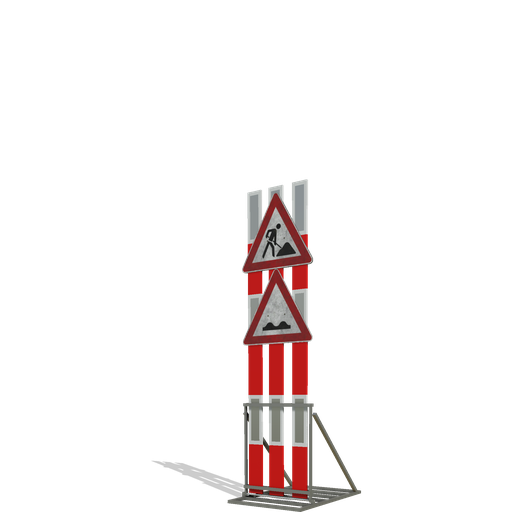

# Schweizer Absperrsystem – Mod für Farming Simulator 25

## 🛠 Beschreibung

Dieses Mod bringt ein **modulares Schweizer Absperrsystem** in den Farming Simulator 25. Ideal geeignet für Baustellen, Straßensperren oder temporäre Umleitungen auf TP-Maps oder im Multiplayer.

Das System basiert auf realen Schweizer Vorbildern und enthält reflektierende Elemente sowie eine einfache Platzierung für individuelle Kombinationen.

## 🔧 Features

- Absperrlatten
- Versionen in **2 m**, **3 m** und **4 m Länge** jeweils konfigurierbar
- Konfigurierbare Vorsignale
- Platzierbare Objekte für flexible Verwendung
- Kompatibel mit MP und allen TP-Maps

## 📂 Inhalt

- Platzierbare 4 Meter, 3 Meter und 2 Meter Elemente
- Platzierbare Bodenmarkierungen (Orange) in diversen Grössen
- Platzierbare Vorsignale
- Kaufbare Vorsignale
- Kaufbare Deko Paletten
- Kaufbare 2m, 3m und 4m Elemente

## 🧱 Credits

- Modell, Texturen, XML & Scripts: **fmods**
- Danke an Came fürs testen meiner Mods
  
## 📜 Lizenz

Dieser Mod darf **nicht ohne Zustimmung weiterverbreitet oder verändert** hochgeladen werden.

## 📎 Hinweise

- Mod befindet sich aktuell in der finalen Testphase
- Für Feedback, Bugs oder Ideen bitte Kontakt über Discord: `fmods` oder über GitHub Issues

📥 [Mod herunterladen](https://mega.nz/file/nlp3iSBZ#BAwBybJFmULWThOPCFdWjAlqvtC2BvQLyATGxGGrnRI)

**Viel Spaß!**  
*– fmods*
